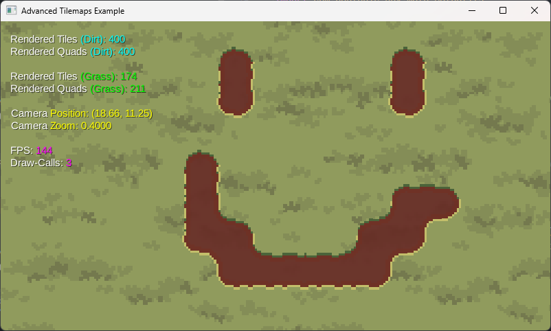
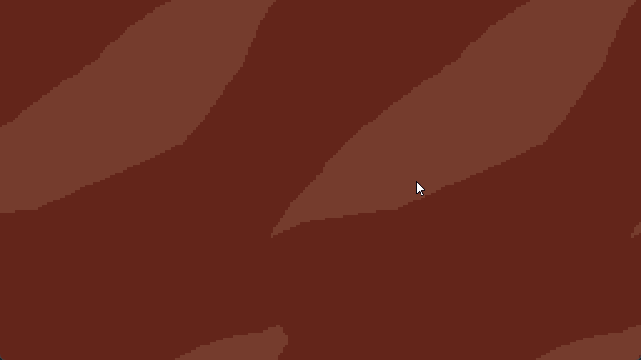
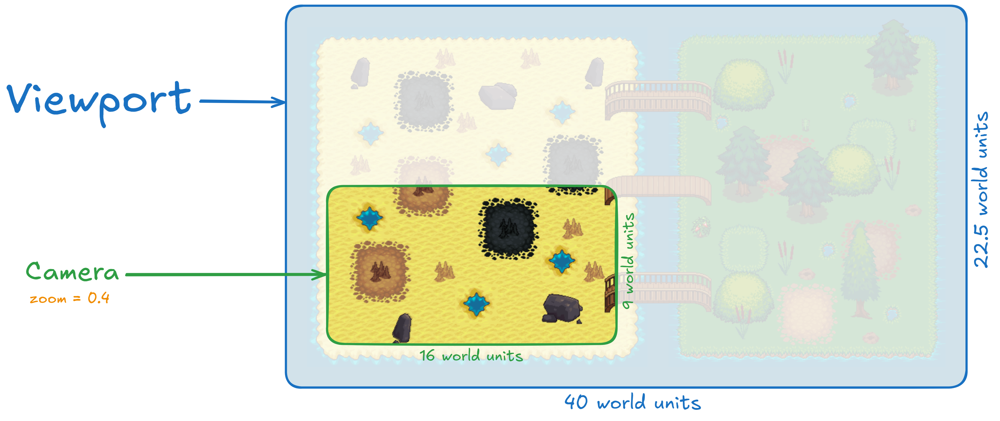

Advanced Tilemaps
---
Ever wondered how you can create awesome, overlayed, auto-tiled, 
multi-layered, viewport-managed, and efficient tilemaps in libGDX 
using the **dual grid** system?

What's the dual-grid system?
---
The dual-grid system is a basically a mechanism similar to 
the marching squares algorithm, it allows to test the tile 
corners using a 4-bit long bitmask, this allows you to automatically 
set the tile texture based on the 4 corners. Why's that ideal? 
Well, now you don't have to draw 256 different tile combinations 
to display a nice tilemap with round edges and corners, that's only 
if you're testing the tile edges. Instead, you only have to 
provide a tile-set consisting of 16 different tile combinations 
which is just suitable for testing using the tile corners. That's 
a huge amount of work spared for a simple tile layer!



The first time I saw the dual-grid system was in an awesome 
dev-log by [jess::codes](https://www.youtube.com/@jesscodes), 
she's really an awesome and talented game developer!

The mechanisms implemented in this simple game were basically 
inspired these two videos from her:
* [Draw fewer tiles - by using a Dual-Grid system!](https://www.youtube.com/watch?v=jEWFSv3ivTg)
* [Easy texture overlay shader for tilemaps!](https://www.youtube.com/watch?v=eYlBociPwdw)

Also, just as a side note, the assets used in this repository 
are copied from her demos: 
* [dual-grid-tilemap-system-godot](https://github.com/jess-hammer/dual-grid-tilemap-system-godot)
* [repeated-texture-on-tilemap-demo-godot](https://github.com/jess-hammer/repeated-texture-on-tilemap-demo-godot)

Thanks [jess](https://github.com/jess-hammer)!

What does 'overlayed' mean?
---
Every `TileLayer` uses a [custom shader](/assets/shaders) to render 
an overlay texture on top of the color mask of the tile-set (which 
is red by default). This you to have a non-repetitive and seamless 
texture rendered on your layers, it also enables you to draw art 
that's bigger than just a single tile in size.

What does 'auto-tiled' mean?
---
Every `TileLayer` utilizes a mechanism to bitmask every tile and 
change the tile-set index of that tile based on the 4 corners and 
their surrounding neighbors. This enables the game to automatically 
display the right tile texture based on the neighbors and that's 
called auto-tiling.



And what does 'multi-layered' mean?
---
The approach here is to implement the logic into separate instances 
of `TileLayer` and then render them in the order you'd like, this allows 
you to auto-tile multiple tile types in the same map.

Finally, what does 'viewport-managed' mean?
---
The game is viewport managed, that means that you don't have to 
use ANY pixels in your game. The only units you work with are 
the so-called world units. And you define them!

A simple example: Every tile in this game is, actually, **1x1 
world units** in size. That's ideal because this approach 
scales well when you're building your game for other platforms 
with different screen sizes and resolutions.

Maybe a small diagram can help you understand [the code](example/src/main/java/me/nulldoubt/advancedtilemaps/example/AdvancedTileMaps.java#L121-L122)?



The viewport in our case is basically just what defines 
the part that we want to *see* from the world. But not, 
actually, the camera is what we see. When you set the 
camera zoom to 1.0, then you see the whole viewport. 
*And don't worry, your world may be bigger than the viewport!*

How to use the library?
---
The library consists of a single, configurable class `TileLayer`.

First, you have to create an instance of that class, 
using this constructor:
```java
new TileLayer(
        int tilesX,         // width of the world in tiles
        int tilesY,         // height of the world in tiles
        float tileWidth,    // tile width
        float tileHeight,   // tile height
        float unitScale,    // unit-scale of the world
        boolean fill        // initial-state of this layer (should it be empty, or filled?)
);
```
and when you have an instance, you should immediately set the tile-set:
```java
tileLayer.setTileSet(textureRegion);
```
and, optionally, if you'd like to integrate an overlay into the 
tileLayer, then you can use this method:
```java
tileLayer.setOverlay(overlayTexture, overlayShader);
```

So, now you've finally configured a tile layer, what next?
In your render pipeline, you'll be able to render the 
tileLayer using this snippet:
```java
tileLayer.setView(camera); // We set the view-bounds to the camera (see overloaded methods).
tileLayer.render(batch); // We render using an instance of a batch.
```

If you're facing any issues with texture-bleeding, then 
this library has gotten your back! Play a bit using the 
`TileLayer.setInsetTolerance(float, float)` method and find 
the sweet spot for your texture. Depending on your texture 
size, the inset tolerance should be between 
`0.001 (>= 4096 pixels)` and `0.05 (<= 16 pixels)`.

If you have a different tile-set layout than the default 
one (as seen in the example), then you can use the 
`TileLayer.setAutoTileConfiguration(IntMap<Byte>)` method 
to provide a custom auto-tile index-mapping. **Note that, 
as of now, this is a static property and it will modify 
the configuration of all tile layers.**

You can check out the `TileLayer` class and its methods, 
there are many nice methods that allow you to customize 
it to your liking and also some getters and setters amongst 
other utility methods.

If you're having trouble with something, or would like to 
report a bug, request a feature, request an optimization, or 
anything else, then open an issue here on GitHub.

Also, contributions are welcome!

How to run the example?
---
It's really simple, just clone the repository and run 
it using the gradle-wrapper. Using this command:
```shell
./gradlew clean :example:run
```

How to build the library?
---
Building is simple as well, clone the repository and 
build the jar file using the gradle-wrapper. Using this command: 
```shell
./gradlew clean :library:jar
```

Or even better, this *library* is literally [a single class](library/src/main/java/me/nulldoubt/advancedtilemaps/TileLayer.java), 
just copy it to your project and done!

Future?
---
I will try my best to maintain this library and fix future 
bugs, maybe even implement features and optimize it. Pull 
requests are very welcome.

As of now, the TileLayer class is pretty optimized. It can handle 
large worlds efficiently.

License?
---
This library (not the example assets!) is public domain.
By library, I mean everything within the [library](library) folder.
